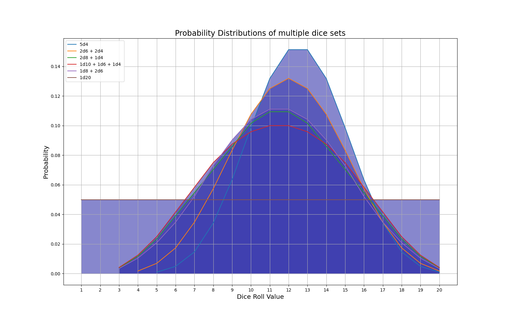

# Dice Summing: Probability and Plots

## Written by Charlie Cook, Feb. 21st 2021

This python module contains code for calculating and comparing the distributions of rolling any arbitrary list of dice which have integer values and start from 1.
It can also calculate the distribution of rolling n of a die and dropping the lowest k < n rolls; This is seen when generating ability scores (4d6 drop 1) in D&D, or when rolling with advantage (2d20 drop 1).
It requires `numpy` and `matplotlib`.

Here's a preview of it, showing six ways to roll with a maximum of 20:

